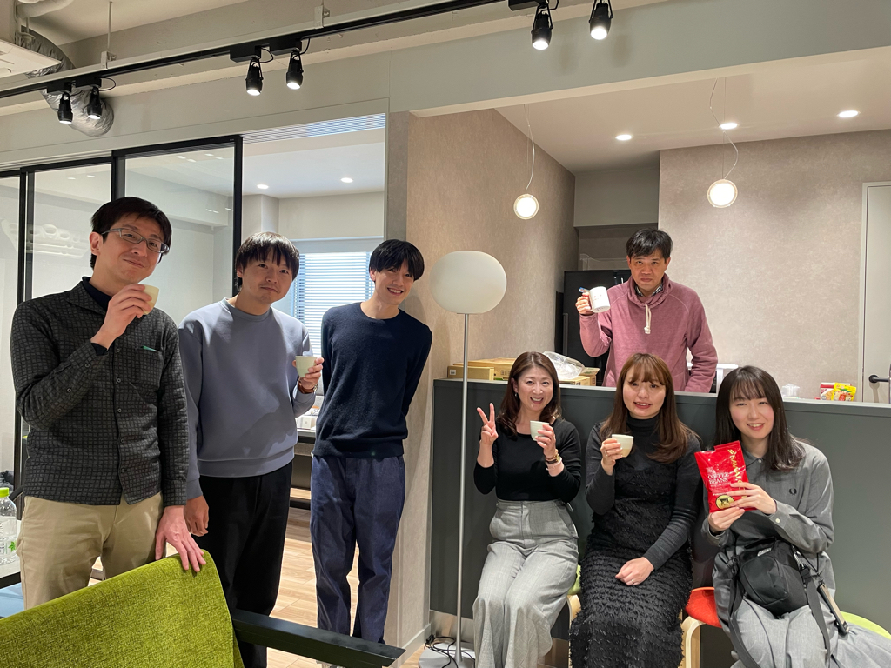
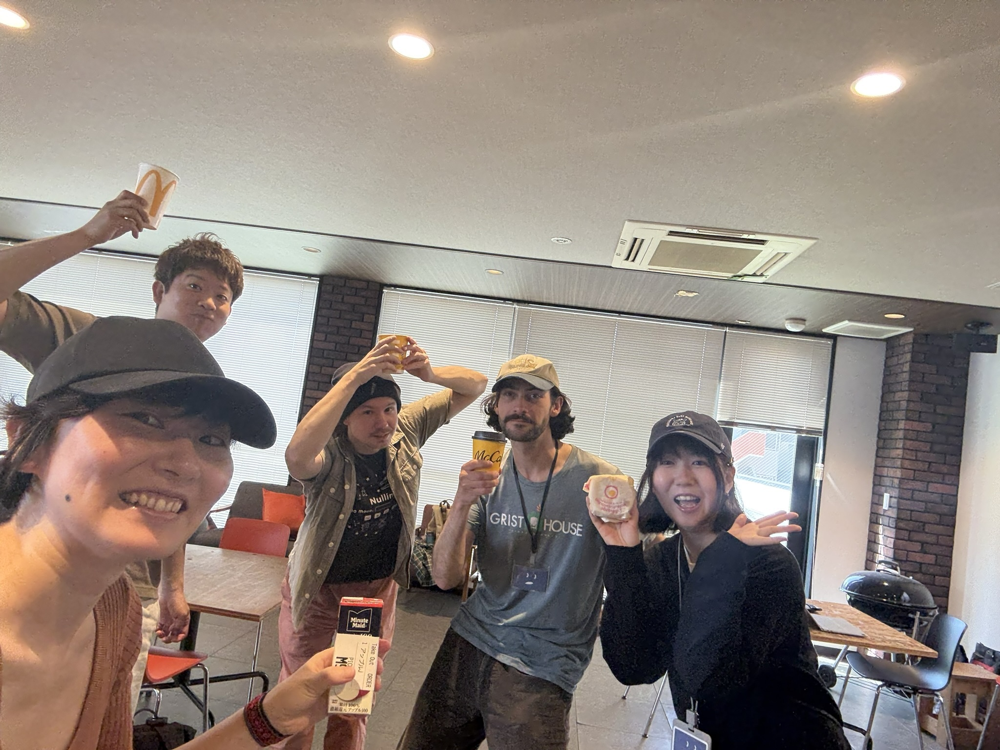

<!-- _class: lead -->

# 文系出身の私がウェブサイトを
# 作るエンジニアになった話

〜好きや興味から広がるキャリア〜

株式会社ヌーラボ 榎本麗

---

<!-- _class: lead -->

## 今日話すこと

- 📚 第1章：自己紹介とこれまでのこと
- 🚀 第2章：エンジニアになった理由
- 💻 第3章：今の仕事について

---

<!-- _class: lead -->

## 📚 第1章:自己紹介とこれまでのこと

---

<!-- _class: lead -->

### 榎本 麗 @uraranbon

- 職業：💻 フロントエンドエンジニア
- 趣味：📚 読書、🏸 バドミントン
- 好き：🍜 うどん、🩷 ヤドン
- 出身：🗾 神奈川

---

<!-- _class: lead -->

---

<!-- _class: lead -->

## 経歴

| 年月 | 出来事  | 備考|
|--------------|---------------------------------------|---------------------------------|
| 2011年〜2015年 | 大学生 | 外国語学部（文系）  |
| 2014年〜  | ライターになる| 在学中にメディア運営会社で働く   |
| 2015年〜  | 喫茶店店員| フリーターになる |
| 2018年〜2023年 | フロントエンドエンジニア  | 未経験から転職・前職での経験 |
| 2024年1月 | ヌーラボに入社| 自社開発エンジニアとして勤務 |
| 2024年6月 | 福岡に移住| エンジニアが活発な地域として選択 |

---

<!-- _class: lead -->

## 📚 🚀 第2章：エンジニアになった理由

---

<!-- _class: lead -->

## 学生時代：典型的な文系📗✏️

- 📖 子供の頃は読書が大好き
- 🌍 好きな科目は英語
- 🧮 苦手な科目は数学
- 🎓 大学は外国語学部

---

<!-- _class: lead -->

## ライターという仕事との出会い

- ✈️ 留学中に読んでいたメディアの会社で働き始めた
- ✍️ ライターとして就職
- 🎭 裏方の仕事が性に合っていた
- 👩‍💻 インターンからそのまま入社（就活なし）

---

<!-- _class: lead -->

## エンジニアと出会う

- 📗 会社のエンジニアと共通の趣味をきっかけに交流
- 💻 話すうちにエンジニアという仕事に興味を持つ
- 🤝 人との出会いがキャリアに影響

---

<!-- _class: lead -->

## ITに興味を持って、独学してみる

- 🎮 興味を持ち、独学でウェブ制作を始める
- 💥 コードを書いた通りに動く楽しさを知る
- ✨ ゲームのようで面白かった

---

<!-- _class: lead -->

## 一度は別の道へ…

- ☕️ 一度IT業界を離れ、喫茶店で働く
- 💰 現実的な悩みに直面
- 💻 やっぱりウェブの仕事がしたいと思うように

_💡回り道が気づきのきっかけに_

---

<!-- _class: lead -->

## 未経験からエンジニアに

- 💻 未経験OKのエンジニア職に挑戦
- ✏️ 独学で作ったポートフォリオサイトが採用の後押しに
- 🔤 TOEIC（英語の試験）の点数がアピールに。学生時代の英語力が意外と役立った
  - 「英語のドキュメント（説明書）を読めます」

_💡文系の学びも無駄にならない_

---

<!-- _class: lead -->

## 受託開発のエンジニアとして働く

- 企業や店舗のサイトを制作
- ほかの人が考えたデザインを、実際のサイトとして形にする役割

---

<!-- _class: lead -->

## やりがい

- 🎮 次々にいろいろなサイトを作る
- ⚡ もっと効率よく作るには？と工夫するのがゲームみたい

---

<!-- _class: lead -->

## 自社開発へ

いろいろな制作経験を通じて、
自社サービスに向き合いたいと思うように。
そこで出会ったのがヌーラボでした。

_💡キャリア選択には段階がある_

---

<!-- _class: lead -->

## 💻 第3章：今の仕事について

---

<!-- _class: lead -->

## ざっくりと会社の紹介

---

<!-- _class: lead -->

## ざっくりと会社の紹介

---

<!-- _class: lead -->

💻　出社は自由です（全く出社しなくても問題ない）

🕰️　働く時間も自由に決められます（5〜22時の範囲）

---

<!-- _class: lead -->

## 私の1日のスケジュール

🏠 家で働くときの例

| 時刻        | 内容                   |
|-------------|------------------------|
| 9:00        | 🌅 起床                |
| 9:45〜10:15 | 💻 英会話              |
| 10:30       | 💻 仕事開始            |
| 13:00       | ☕ ランチ         |
| 14:00       | 💻 午後の仕事          |
| 19:30       | ♨️ 退勤               |

---

<!-- _class: lead -->

## 私の1日のスケジュール

🏢 会社で働くときの例
🚲 出社するときは福岡オフィスに行きます（自転車で5分）

| 時刻        | 内容                   |
|-------------|------------------------|
| 9:00        | 🌅 起床                |
| 9:30 |  💻 仕事開始              |
| 13:00       | 🚲 ランチ・出社        |
| 14:00       | 💻 午後の仕事       |
| 19:30       | 🏓 退勤、卓球をする |

---

<!-- _class: lead -->

## 🏓 卓球？

---

<!-- _class: lead -->

🏓 社員同士で集まる部活があって、
いい気分転換になっています

---

<!-- _class: lead -->

## 部活動

さんぽ部

---

<!-- _class: lead -->

## 部活動

読書部

---

<!-- _class: lead -->

## 部活動

コーヒー部
東京オフィス

他 60個くらい

---

<!-- _class: lead -->

## 服装

ラフな格好

※朝マック部

---

<!-- _class: lead -->

## どんな仕事をしているの？

- 🧹 ウェブサイトをもっと使いやすくするための更新
- 📝 新しい情報を見てもらうためのページ作り

---

<!-- _class: lead -->

## エンジニア = 理系？

エンジニアというと理系のイメージがあるかもしれませんが、
実は文系のスキルもすごく役に立ちます

- 💬 仕事仲間とのコミュニケーション - 文章で伝える機会が多い
- 📚 分からないことを調べて、分かりやすくまとめる力
- 🤝 丁寧なコミュニケーション - 仕事もスムーズに進む

_💡ライターの経験が活きています_

---

<!-- _class: lead -->

仕事のやりがい

## 誰かの役に立つ喜び

「誰かの役に立てた」と感じる瞬間が、とても嬉しいです。

ウェブの良さは、一度作ったものがずっと動き続けること。
もしかしたら、自分の仕事が世界のどこかに届いているかも…。

そんなワクワク感が、この仕事にはあります。

---

<!-- _class: lead -->

仕事のやりがい

## アクセシビリティへの取り組み

※アクセシビリティとは、
年齢・身体・環境に関わらず、
誰もが使いやすいようにする工夫のことです。

視覚や聴覚に障がいのある方、身体に特性のある方、
一時的に手が使えない方や高齢の方など、
さまざまなユーザーに情報がしっかり届くよう、
意識してウェブサイトを作っています。

---

<!-- _class: lead -->

仕事のやりがい

## 学び続けられる楽しさ

新しい技術や考え方を知るたびに、
「昨日の自分より少しできるようになった」と感じられる。

毎日がちょっとした成長の積み重ね。
それがこの仕事の面白さのひとつです。

---

<!-- _class: lead -->

## ITやエンジニアに関するよくある質問

🧮 理系科目が苦手...
→ 私も得意ではありませんでしたが、エンジニアになれました。
理系科目だけがすべてではありません。

⏰ 今から始めても遅い？
→ 「遅い」なんてことはありません。
社会人になってからでも進路を変えることはできます。

👩 女性が少ないのでは？
→ 案外女性エンジニアもたくさん活躍しています。

---

<!-- _class: lead -->

## どうやったらエンジニアになれるの？

- ❌ 資格は必要ありません
- 🔄 途中でキャリアチェンジもできる（私は喫茶店→エンジニア。同僚にはケーキ屋やスケートボードショップ出身もいます）

---

<!-- _class: lead -->

## 向いている人

- 😴 めんどくさがりや - 根本から解決してあとは楽にするタイプ
- 🚀 自分で考えて行動できる人
- ✨ 新しいもの好き
- 💻 1日パソコンの前にいても苦じゃない人

---

<!-- _class: lead -->

# 学生時代にやって良かったこと

## いろんなバイトをしてみたこと

- いろんなバイトを経験
- ☕️ カフェ、📦 郵便物の仕分け、🍱 お弁当屋、📱 スマホ販売…
- スマホ販売で「自分は営業ができない...」と知る

_💡大事なのは「やりたいこと」より「やりたくないこと」を知ること_

---

<!-- _class: lead -->

## おすすめの学習リソース

もしエンジニアに興味があるなら：

- 📚 手を動かす系の本
- 🎥 実践的な動画

_💡まずは小さく始めてみよう！_

---

<!-- _class: lead -->

## 💫 最後に伝えたいこと（まとめ）

---

<!-- _class: lead -->

💡 文系でも大丈夫。今までの経験は、きっとどこかで役に立つ

💡 興味を持ったら、まずはやってみるのが一歩目
　　「やりたいこと」より「やりたくないこと」を知るのも大事

💡 キャリアに正解はない。回り道も無駄じゃない
　　人との出会いがきっかけになることもある

---

<!-- _class: lead -->

## 🔚 以上です！

---

<!-- _class: lead -->

## 何か質問はありますか？
どんなことでもOKです！以下は例です

- 🎓 学生時代にやっておけばよかったことは？
- 😅 仕事で大変なことは？
- 💼 転職活動で気をつけたことは？
- 🛠️ おすすめの学習方法は？
